<p align="center">
  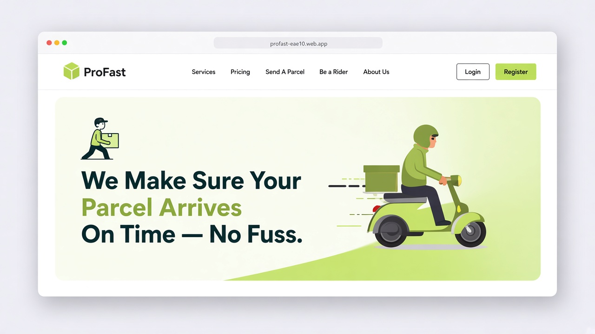
</p>

<p align="center">
  <a href="https://profast.achibhossen.me">Live app</a>
  ·
  <a href="https://profast-api.achibhossen.me">Live API</a>
  ·
  <a href="https://github.com/achibhossengit/profast-backend">Backend Repo</a>
</p>

ProFast is a full-stack parcel delivery management system where users can send parcels, track delivery status in real time, and make secure payments. Riders can earn money by delivering parcels, while admins manage users, riders, and delivery operations across Bangladesh.

This repository is the **client application**. It handles the user interface, client-side routing, authentication screens, and application state.

## ✨ Key Features

- Responsive UI: Public landing pages, auth screens, and a dashboard layout with Tailwind CSS and DaisyUI.
- Client Routing: React Router with private, admin, rider, and guest route guards.
- State Management: Auth and warehouse context, TanStack Query for server data, React Hook Form for forms.
- Firebase Auth (client): Email/Password and Google login, session handling, profile/email/password updates.
- Role-based UI: Navigation and screens change for Admin, Rider, and User after the role is loaded.
- Coverage Map: Leaflet map of service areas, driven by cached warehouse data.
- Payments UI: Stripe Elements checkout in the browser using the publishable key.
- Parcel Forms: Send-parcel flow with client-side price calculation and confirmation dialog.

## 🚀 Tech Stack

| Category       | Technology                                |
| -------------- | ----------------------------------------- |
| UI             | React 19, Vite 7, Tailwind CSS 4, DaisyUI |
| Routing        | React Router 7                            |
| State          | TanStack Query, React Context             |
| Forms          | React Hook Form                           |
| Authentication | Firebase Authentication                   |
| Payments       | Stripe.js                                 |
| Map            | Leaflet                                   |
| Deployment     | Firebase Hosting                          |

## 🛠️ Installation & Setup

```bash
git clone https://github.com/achibhossengit/profast-client.git
cd profast-client
npm install
```

Create a `.env` file in the project root:

```env
VITE_FIREBASE_API_KEY=<Your Firebase API key>
VITE_FIREBASE_AUTH_DOMAIN=<Your Firebase authentication domain>
VITE_FIREBASE_PROJECT_ID=<Your Firebase project ID>
VITE_FIREBASE_STORAGE_BUCKET=<Your Firebase storage bucket>
VITE_FIREBASE_MESSAGING_SENDER_ID=<Your Firebase messaging sender ID>
VITE_FIREBASE_APP_ID=<Your Firebase application ID>

VITE_STRIPE_PUBLISHABLE_KEY=<Your Stripe publishable key>
VITE_IMGBB_API_KEY=<Your ImgBB API key>
VITE_SERVER_URL=<Your backend server URL>
```

`VITE_FIREBASE_AUTH_DOMAIN` is required to avoid CORS issues during authentication.

```bash
npm run dev
```

The app runs at [http://localhost:5173](http://localhost:5173).

```bash
npm run build
npm run preview
```

## 📁 Project Structure

```text
src/
  contexts/     Auth and warehouse providers
  hooks/        Auth, Axios, and status helpers
  firebase/     Firebase client initialization
  router/       Route table
  routes/       Private, admin, rider, and guest guards
  layouts/      Root, auth, and dashboard layouts
  pages/        Public, auth, and dashboard screens
```

## 🧭 Routing

| Guard               | Used for                               |
| ------------------- | -------------------------------------- |
| `NonLoggedInRoutes` | Login, register, forgot password       |
| `PrivateRoutes`     | Dashboard and rider application        |
| `AdminRoute`        | User management and rider applications |
| `RiderRoute`        | Earnings                               |

| Path                                                  | Screen             |
| ----------------------------------------------------- | ------------------ |
| `/`                                                   | Home               |
| `/services`                                           | Coverage map       |
| `/be-rider`                                           | Rider application  |
| `/login` `/register` `/forgot-password`               | Authentication     |
| `/dashboard`                                          | Role-based home    |
| `/dashboard/send-parcel`                              | Create parcel      |
| `/dashboard/parcels/:delivery_status/:payment_status` | Parcel list        |
| `/dashboard/parcels/:id`                              | Parcel details     |
| `/dashboard/payments/:parcelId`                       | Stripe payment     |
| `/dashboard/payment-history`                          | Payment history    |
| `/dashboard/track-parcel/:id?`                        | Parcel tracking    |
| `/dashboard/profile`                                  | Profile            |
| `/dashboard/rider-applications`                       | Admin applications |
| `/dashboard/users/:role/:district`                    | Admin users        |
| `/dashboard/my-earnings`                              | Rider earnings     |

## 🗃️ State Management

| Layer               | Responsibility                                                          |
| ------------------- | ----------------------------------------------------------------------- |
| `AuthProvider`      | Firebase session, login/register/logout, profile updates, and user role |
| `WarehouseProvider` | Coverage data (cached in `sessionStorage`) for maps and parcel forms    |
| TanStack Query      | Server data for parcels, payments, users, and applications              |
| React Hook Form     | Form state on auth, parcel, and profile screens                         |
| `useAxiosSecure`    | Attaches the Firebase ID token; redirects on `401` / `403`              |

After login, the client stores the Firebase user, fetches `GET /users/role`, and uses that role for navigation and route guards.

## 💰 Parcel Pricing

Price is calculated in the send-parcel form before the request is sent:

| Type         | Same city | Different city |
| ------------ | --------- | -------------- |
| Document     | ৳60       | ৳80            |
| Non-document | ৳110      | ৳150           |

Non-document parcels add **৳40 per kg** over 3 kg.

## 📸 Media

#### Homepage

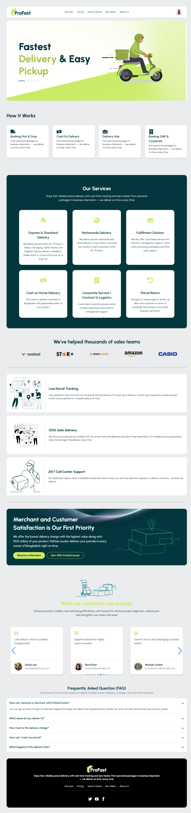

#### Login Page

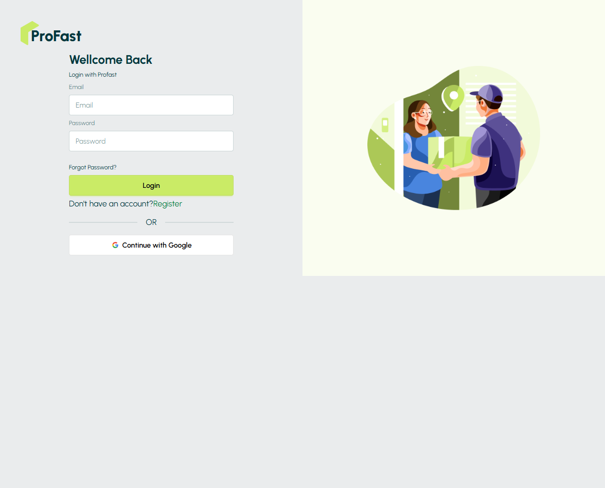

#### Register Page

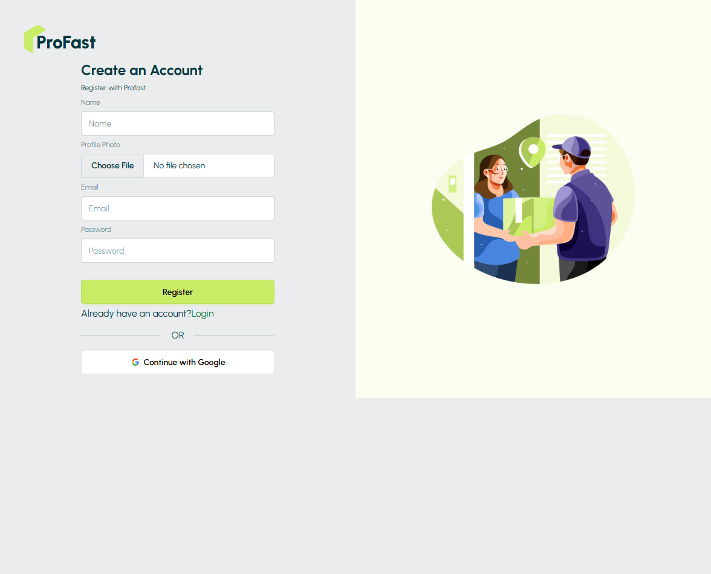

#### Profile Page

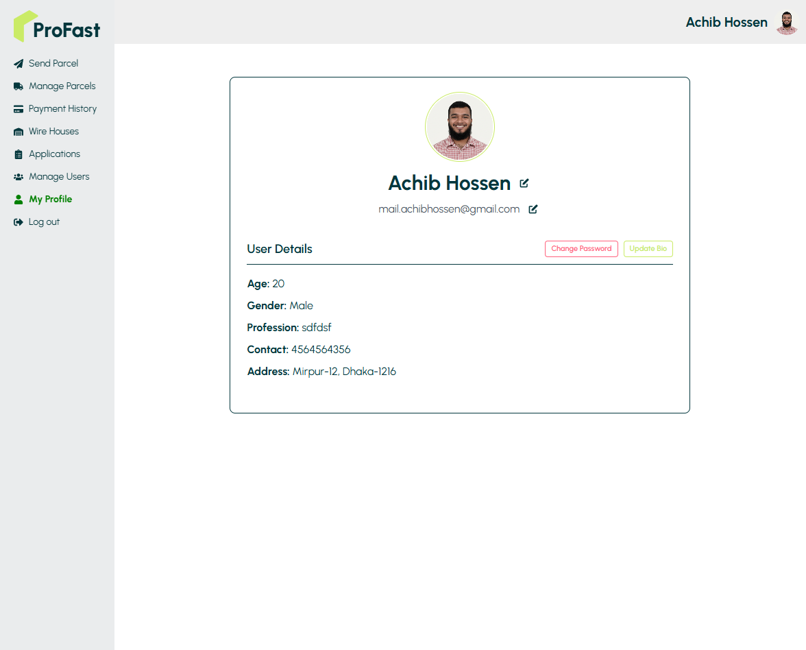

#### Manage User (Admin)

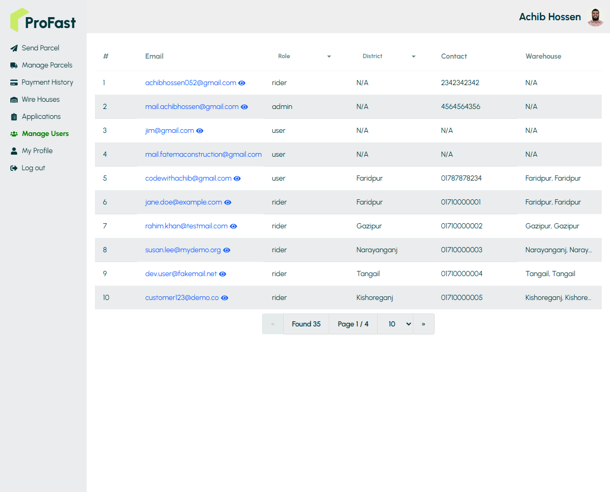

#### Manage Parcel

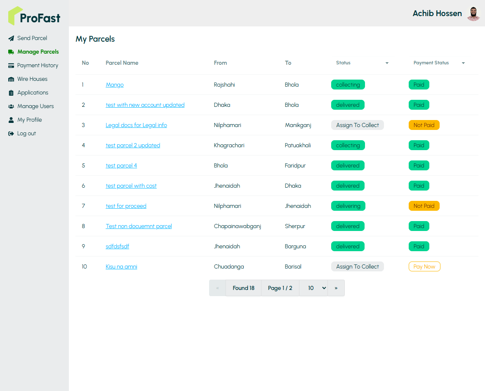

#### Assign Rider (Admin)

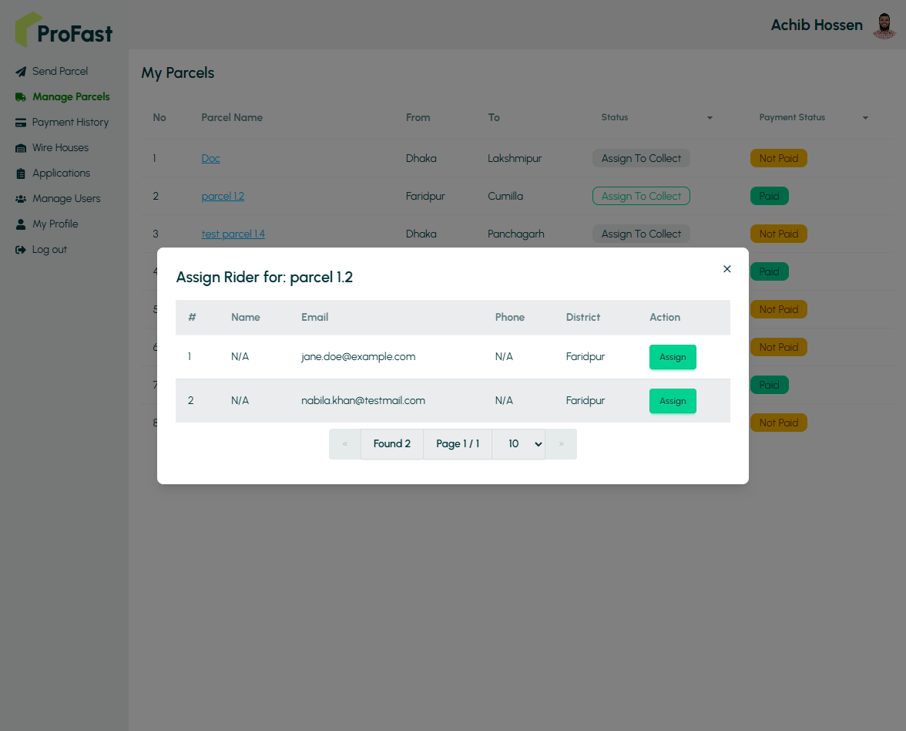

#### Parcel Details

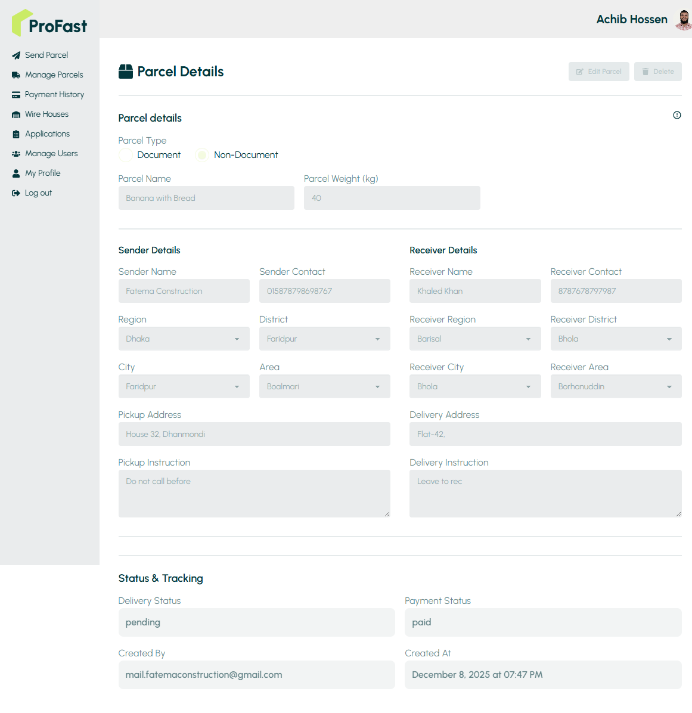

#### Parcel Payment

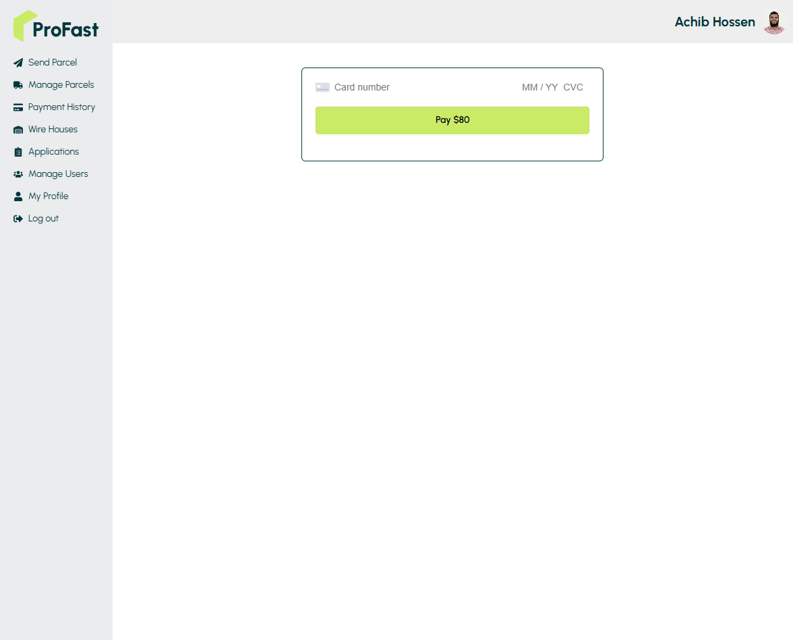

#### Send Parcel

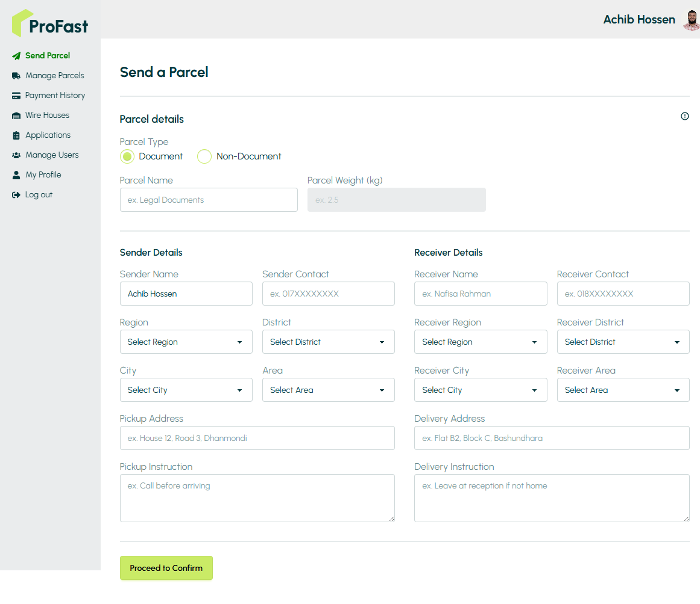

#### Coverage Map

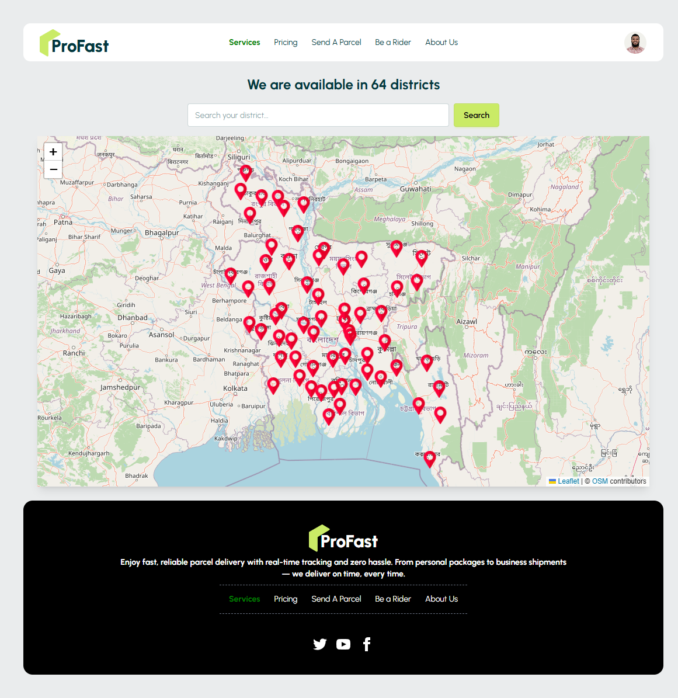

#### Access Denied

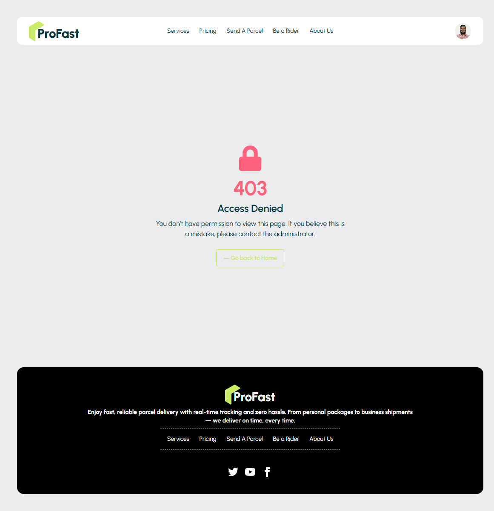

#### Not Found

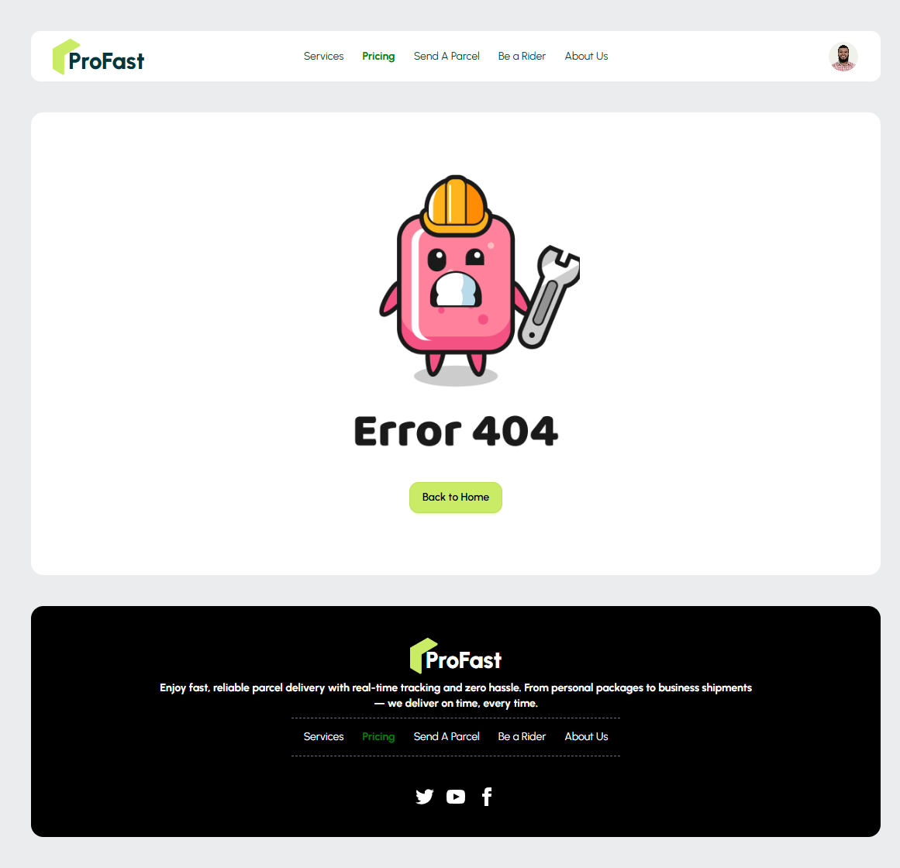
